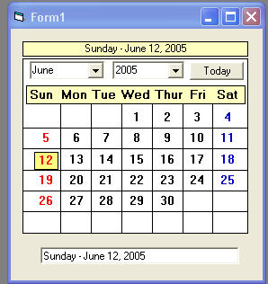



## DropDown Calendar UserControl

### Description

A dropdown calendar usercontrol. The reason I am submitting it ,is in hopes someone knows how to get it to cover the under lying controls on the form it is on,without having to set the Zorder. I want it to be self contained. No external modules. Any and all help is welcome.
 
### More Info
 

             |
---                |---
**Submitted On**   |2005-06-13 12:14:04
**By**             |[Kenneth Foster](https://github.com/Planet-Source-Code/PSCIndex/blob/master/ByAuthor/kenneth-foster.md)
**Level**          |Intermediate
**User Rating**    |5.0 (10 globes from 2 users)
**Compatibility**  |VB 6\.0
**Category**       |[Custom Controls/ Forms/  Menus](https://github.com/Planet-Source-Code/PSCIndex/blob/master/ByCategory/custom-controls-forms-menus__1-4.md)
**World**          |[Visual Basic](https://github.com/Planet-Source-Code/PSCIndex/blob/master/ByWorld/visual-basic.md)
**Archive File**   |[DropDown\_C1900976132005\.zip](https://github.com/Planet-Source-Code/kenneth-foster-dropdown-calendar-usercontrol__1-61097/archive/master.zip)

